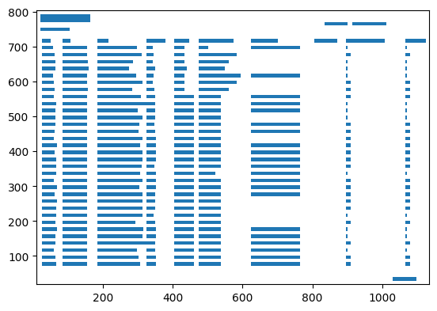

# Ausarbeitung Skriptsprachen SS22 | Marc-Alexander Richts

- Eine Kopie von diesem Dokument befindet sich als .pdf in ./docs
- Github Repo: https://github.com/VIEWVIEWVIEW/Lightstreamer-6.1-python

## Vorwort

Im Rahmen des Moduls durften wir uns ein eigenes Projekt aussuchen, welche die Anwendung der gelernten Fähigkeiten enthalten soll.
Ich habe mich dazu entschieden, eine Library zu schreiben, um live die Preise von Aktienkursen zu ermitteln.

## Hintergrund
Börsen wie LSE, NYSE, XETRA sind die größten<sup>1</sup> Börsen in der Welt. Leider stellen diese Börse keine Preise in Echtzeit für Privatanleger zur Verfügung.
    
- [LSE bietet Marktdaten nur für Redistributoren an.](https://www.lseg.com/markets-products-and-services/market-information/market-data/pricing-and-policies)
- [NYSE verlangt 7.500 USD für den Zugriff plus 16 USD pro Gerät.](https://www.nyse.com/publicdocs/nyse/data/NYSE_Market_Data_Pricing.pdf)

Die Abonnements für Echtzeitpreise bei Firmen, die sich auf das Weiterverkaufen der Daten konzentrieren, liegen in der Regel zwischen 99 und 200 USD pro Monat:
- [Polygon.io - 200 USD pro Monat](https://polygon.io/stocks#stocks-product-cards)
- [Alpaca - 99 USD pro Monat](https://alpaca.markets/docs/market-data/)

Da sich für Kleinanleger solche Abonnements meist nicht lohnen, habe ich mich entschiedenen, eine möglichst kostengünstige Alternative zu finden.

<sup>1</sup>Am Handelsvolumen gemessen.

## Problemstellung

Die [Lang & Schwarz AG](https://www.ls-d.de/) ist Market-Maker für viele Broker, die von Retailinvestoren genutzt werden. Dazu veröffentlicht L&S permanent die neusten Quotes für Produkte auf ihrer [Website](https://www.ls-tc.de/de/). Diese werden ohne Verzögerung und weitere Gebühren direkt an den Kunden gestreamt, der beispielsweise bei einem Broker wie TradeRepublic oder der Sparkasse zu diesen Quotes Order ausführen könnte.

Bedauerlicherweise bietet L&S keine dokumentierte API für das Streamen der Preise. L&S verwendet "[Lightstreamer 6](https://lightstreamer.com/download/#ls60)". Diese Library ist seit einer halben Dekade outdated und wird vom Hersteller nicht mehr unterstützt. Für diese alte Legacyversion gibt es auch keinen Pythonclient, sondern nur einen prekompilierten Javaclient und ein minified Javascriptbundle, welches direkt im Browser zu L&S eine Websocketverbindung aufbaut und das Lightstreamerprotokoll implementiert. Lightstreamer 6 ist ebenfalls, was interne Funktionen und das Protokoll angeht, ebenfalls komplett undokumentiert.

*Im jugendlichen Leichtsinn denkt man sich "ja, da schaue ich einfach in den Networktab und baue die Requests, die über den Websocket laufen nach". Dazu später mehr.* 


## Installationsinstruktionen
### Ghostscript installieren
- [Ghostscript](https://www.ghostscript.com/releases/gsdnld.html) wird benötigt, um alle handelbaren Produkte herunterzuladen. Die handelbaren Produkte werden täglich auf [LS-X](https://www.ls-x.de/de/handelsuniversum) als PDF veröffentlicht. Ghostscript erlaubt das Parsen dieses PDF, um die Produkte in die Datenbank zu schreiben. Ghostscript wird intern als Backend von ``camelot-py`` verwendet. Camelot extrahiert Tabellen aus PDFs.
- [Tkinter](https://wiki.python.org/moin/TkInter) ist eine Abhängigkeit von ``camelot-py``

Ubuntu:
```
sudo apt-get install ghostscript python3-tk
```

MacOS:
```
brew install ghostscript tcl-tk
```

Windows Installer:  
- Ghostscript: https://www.ghostscript.com/releases/gsdnld.html
- Tkinter: https://www.activestate.com/products/tcl/
 
 
### Pythonpakete installieren

Es wird empfohlen ein ``venv`` vorher anzulegen, oder in einem Container zu arbeiten, um nicht die Hauptinstallation zu verunreinigen. Ihr findet ein beispiel venv in der Repo.


Die folgenden Pakete müssten installiert werden (``pip install -r requirements.txt``):
```
beautifulsoup4==4.11.1
camelot-py==0.9.0
numpy==1.23.2
requests==2.28.1
typing_extensions==4.3.0
urllib3==1.26.11
prisma~=0.6.6
websocket-client~=1.3.3
```


--- 

Kurzer Überblick für die wichtigsten Abhängigkeiten:

- Beautifulsoup um Instrument-IDs für Lightstreamer von L&S zu laden
- Camelot-py um Instrumentdaten von L&S zu laden
- Requests um Instrumentdaten von L&S zu laden
- Prisma agiert als ORM, um die Datenbank zu managen
- Websocket-Client zum Herstellen einer Verbindung zum Lightstreamer-Server von L&S

### Setup

Falls mal die aktuelle Datenbank nicht nutzen möchte, sie verloren hat, oder von SQLite zu z.B. Postgresql wechseln möchte, kann man ``prisma db push`` ausführen. Dadurch wird das Datenbankschema aus ``schema.prisma`` auf die Datenbank angewandt. Falls man von SQLite wegmigrieren möchte, kann man einfach die ``datasource`` in der Schemadatei ändern. Mehr dazu auf [prisma.io](https://www.prisma.io/docs/reference/api-reference/prisma-schema-reference)

Nachdem man nun eine ``database.sqlite3`` im Rootverzeichnis liegen hat, kann man das Programm ausführen:
```
$ python main.py
```

Anschließend wird ein Updatecheck durchgeführt. [L&S trackt in einem PDF](https://www.ls-x.de/de/handelsuniversum) die Aktien, die jeweils an dem aktuellen Tag handelbar sind. Sollte ein neues PDF zur Verfügung stehen (wird meist gegen 7 Uhr deutscher Zeit veröffentlicht), oder der letzte Check von Instrument IDs länger als 24h her sein, wird das Update durchgeführt.

Bei dem Update wird das PDF geparst (dies kann je nach System ein paar Minuten dauern. 300+ Seiten parsen dauert ein wenig), und anschließend werden alle extrahierten Informationen in unsere Datenbank geschrieben.


Danach bekommt man eine Demo zu sehen, mit den aktuellen Preisen von ein paar liquiden Aktien, wie z.B. Tesla und Porsche. Es sind die Handelszeiten der jeweiligen Börse zu beachten, da nur der aktuellste Preis, der über den Stream hereingekommen ist, angezeigt wird. Historische Preise bekommt man über den Websocket nicht.

Diese Demo soll einfach nur die Benutzung der Library zeigen. Der Nutzer soll selbst diese Library später nutzen, um z.B. technische Analyse durchzuführen und Order an den Broker seiner Wahl zu senden. 

## Protokollaufbau & Schmerzen

Lightstreamer verwendet intern andere IDs als diese uns von der [Handelsuniversum.pdf](https://www.ls-x.de/de/handelsuniversum) geboten werden. Daher laden wir dieses PDF runter, parsen alle Daten, und befragen anschließend den Suchendpunkt von L&S mit der aus dem PDF extrahierten ISIN (hier ``DE000PAH0038``):
```GET
https://www.ls-tc.de/_rpc/json/.lstc/instrument/search/main?q=DE000PAH0038&localeId=2
```

Als Antwort bekommen wir einen JSON-String:
```json
[
	{
		"id": 41519,
		"displayname": "PORSCHE AUTOM.HLDG VZO",
		"isin": "DE000PAH0038",
		"wkn": "PAH003",
		"categoryid": 5,
		"productcount": 19,
		"alias": "",
		"categorysort": 1,
		"instrumentId": 41519,
		"categorySymbol": "STK",
		"categoryName": "Aktie",
		"url": 41519,
		"link": "/de/aktie/41519"
	}
]
```

Die ``instrumentId`` speichern wir uns ab. Die meisten anderen Daten haben wir bereits aus der geparsten PDF und liegen bereits in unserer Datenbank.

Nun können wir beginnen mit Lightstreamer zu kommunizieren.

Lightstreamer möchte, dass wir mit einer magic Value `phase` eine Session erstellen.


Wofür diese genutzt wird, kann ich mir leider nicht erklären, jedoch hatte Giuseppe Corti, ein Programmierer bei Lightstreamer, auf Nachfrage eine [Antwort im offiziellen Forum](https://forums.lightstreamer.com/showthread.php?8945-What-does-setPhase()-in-the-js-client&p=15723#post15723):

> The old web libraries used an undocumented private protocol specific to the javascript languages.
> So it is not a good idea to try to reverse engineering that protocol in order to apply it to other languages.
> For example the LS_Phase is a very specific element of the javascript protocol used to recognize possible duplicate replies but which do not make sense in other languages.

--  giuseppe.corti, August 2nd, 2022, 05:12 PM


Auch nicht wirklich hilfreich, da ich noch immer nicht weiß, wie genau sie generiert wird. Das Javascriptbundle ist leider minified und ich habe viele Stunden damit verbracht, Variablen- und Funktionsnamen herzuleiten, jedoch bin ich nicht bis zum Generator der Phase gekommen.

Wie dem auch sei: Der Server disconnected uns mit "Unexpected Error", wenn wir eine für ihn invalide Phase schicken, wir können also nur blind Blackbox testen. Die Phase muss zwischen drei und vier Zahlen bestehen und auf "3" enden.

Nachdem wir unsere Phase generiert haben, können wir an ``https://push.ls-tc.de/lightstreamer/create_session.js`` ein x-www-formencoded folgende Daten schicken:
```json
        data = {
            "LS_op2": "create",
            "LS_phase": self.phase, // <-- z.B. 2103
            "LS_cause": "new.api",
            "LS_polling": "true",
            "LS_polling_millis": "0",
            "LS_idle_millis": "0",
            "LS_cid": "pcYgxn8m8 feOojyA1S681m3g2.pz478mF4Dy",  // magic value for identifying client
            "LS_adapter_set": self.adapter_set,
            "LS_container": "lsc"
        }
```
Als Adapterset wird in diesem Fall "WALLSTREETONLINE" gesetzt. Das Adapterset wurde von L&S geschrieben, und wird eigentlich als Streamingadapter verwendet. Wir parsen später auch die Daten von diesem Adapter, jedoch auf nur sehr triviale Weise.

Andere Parameter wie der ``LS_container`` beschreiben im eigentlichen Javascriptclient nur, wo die ganzen Elemente gemounted werden sollen. Der Server sendet uns JS im gegenzug "over-the-wire":
```js
var myEnv = lsc;
var phase = null;
function setPhase(ph) {
 phase = ph;
}

function start(sID, addr, kaMs, reqLim, srv, ip) {
 LS_window.LS_e(1, phase, sID, addr, kaMs, reqLim, srv, ip);
}

function loop(holdMs) {
 LS_window.LS_e(2, phase, holdMs);
}
setPhase(9701);start('S7da7fa826970728cT0118850', null, 0, 50000, 'Lightstreamer HTTP Server', '10.0.16.33');loop(0);
```


Was sehen wir hier?

Der Server sendet uns JS mit unserer Phase. Diese endet nicht auf "3", es gibt also auch Phasen, die nicht unserem oben erkanntem Muster entsprechen. Warum das so ist, weiß ich leider bis heute nicht. Ich habe auch schon versucht Quersummen auszurechnen und Muster in den Bytedarstellungen von den Phasen zu finden, aber ich komme nicht darauf. Immerhin funktioniert unsere Methode von weiter oben...

Und wir sehen eine SessionID. Diese extrahieren wir einfach mit einem schönen Regex und speichern uns ab.
Dahinter leakt der Webserver übrigens noch eine interne IP, sowas macht man eigentlich nicht.

---

Egal, wir haben jetzt alles, was wir brauchen: Eine Phase und eine Session-ID! Zeit, um den Websocket zu öffnen.

Hier müssen wir darauf achten, dass wir als Subprotokoll ``js.lightstreamer.com`` angeben.

```python3
self.ws = websocket.WebSocketApp(self.websocket_url,
                                         subprotocols=self.subprotocols,
                                         header=[
                                             "User-Agent: Mozilla/5.0 (Windows NT 10.0; Win64; x64; rv:103.0) Gecko/20100101 Firefox/103.0"
                                             ])

```

Danach senden wir unser erstes Paket mit Inhalt: Wir dürfen unseren Websocket an die eben erstellte Session binden.

Im Browser sieht das so aus:
```
bind_session
LS_session=S1d3970ef9ad97e22T1132600&LS_phase=1303&LS_cause=loop1&LS_keepalive_millis=5000&LS_container=lsc&```
````
Was einem der Networktab im Browser jedoch nicht sagt: Es darf nicht einfach der Linux Linebreak ``\n`` verwendet werden. Dann bekommen man einen Disconnect mit "Unexpected Error". Stattdessen muss wie in Windows-Fashion Carriage-Return mitgeschickt werden:

````
bind\r\nLS_session[..]
````

Sieht man mit dem Auge natürlich nur sehr schlecht, und ist mir erst aufgefallen, als ich angefangen habe, mit Wireshark die ganzen Pakete zu dumpen und dann mit dem eingebauten Hexeditor angeschaut habe. 


## Probleme bei der Entwicklung

### Schmerzpunkte von Lightstreamer:
- Der Server disconnected uns, wenn wir "js.lightstreamer.com" nicht als Subprotocol für den Websocket angeben
- Der Server disconnected uns, wenn wir keine Origin "https://www.ls-tc.de" angeben
- Der Server disconnected uns, wenn wir im Frame des Websocketpaketes nicht ``0001`` als Bytes an der Stelle 4 - 7 setzen. Offenbar machen Browser das standardmäßig so. ``Websocket-Client`` für Python macht das leider standardmäßig nicht. Auch andere Websocketlibraries für Python waren unangemessen und triggerten bei verschiedensten Aktionen Disconnects. ``Websocket-Client`` hat jedoch alles sehr low level gehalten und keine unnötigen Abstraktionen eingebaut.
- Der Server disconnected uns, wenn wir `\n` als Linebreak verwenden. Wir müssen `\n\r` verwenden.

### Camelot
Zum Parsen der PDFs wird die Library "Camelot" verwendet. Camelot versucht Tabellen innerhalb der PDFs zu rekonstruieren. Jedoch können bei Texten, die zu nah aneinander stehen, mehrere Zellen fälschlicherweise als eine einzelne angesehen werden.

#### Beispiel

In diesem Beispiel wird "ZZUH" fälschlicherweise mit in die Zelle für den Namen des Assets angefügt, da der Abstand zwischen den zwei Texten in dem PDF nicht groß genug ist. 


Das Ergebnis nach dem Parsevorgang ist folgende Tabelle:

| WKN    | ISIN         | Name                          | Shortcode |
|--------|--------------|-------------------------------|-----------|
| A270EB | CH0508793459 | 21SHARES SYGNUM MOON **ZZUH** |           |
| A3GW2D | CH1135202096 | 21SHARES UNISWAP ETP          | 2UNI      |
| A2JN55 | FR0013341781 | 2CRSI S.A.  EO-,09            | 52C       |
| A0HL8N | DE000A0HL8N9 | 2G ENERGY AG                  | 2GB       |

Um diesen Fehler zu korrigieren, kann man an ```camelot.read_pdf``` den Parameter ``columns`` übergeben. ``columns`` nimmt eine
Liste von vertikalen Koordinaten innerhalb der PDFs entgegen: ``columns=['72,95,209,327,442,529,566,606,683']``

Diese Liste enthält Strings der vertikalen Koordinaten für die Spaltentrennungen.

Quirk: es wird dafür keine zweidimensionale Liste verwendet, sondern eine Liste mit einem String pro Tabelle, in welchem kommasepariert die Koordinaten stehen. 

Nun werden alle Texte korrekt erkannt:



---

Da die geparsten Tabellen von Camelot ebenfalls den Header enhalten können, filtern wir mit der Hilfe eines Regex alle Zeilen raus, in denen keine valide ISIN steht.

Eine ISIN besteht aus 12 Zeichen. Die ersten Zwei stellen das Land dar (CH, DE, US usw.) und die zehn nachfolgenden Zeichen sind eine zufällig vergebene alphanumerische ID.

Ein einfacher Regex reicht in diesem Fall:
```python
isin_regex = re.compile(r'[A-Z]{2}\w{10}$')
```


### Dinge, die ich geplant habe, aber nicht mehr umgesetzt bekommen habe

- Ich wollte [Texualize.io](https://www.textualize.io/), um ein Terminal im Stile von [OpenBB](https://openbb-finance.github.io) umzusetzen. Leider felte mir am Ende die Zeit dafür, da ich hätte eine Menge Code refactoren müssen.

- Ich wollte Spread des Marketmakers (Differenz zwischen Angebot und Nachfrage) messen. Bin ich enttäuschenderweise auch nicht zu gekommen.


# Fazit

Ich bin hier bedauerlicherweise nicht groß auf Prisma.io eingegangen, aber der Prisma-ORM-Client hat mich wirklich überzeugt. Es macht sehr viel Spaß ihn zu nutzen, vor allem wegen den Typen, die dann in Typescriptfashion sehr gutes Autocomplete liefern.
Ansonsten: Ich werde vermutlich nie wieder versuchen ein minified Bundle, welches durch einen JS-Moduleloader wie [AMD](https://requirejs.org/docs/whyamd.html#amd) gejagt wurde, lesen. Das Tooling im Pythonokösystem ist ziemlich bipolar: auf der einen Seite findet man super Tools wie Camelot-py, um Tabellen in PDFs zu parsen, auf der anderen Seite haben die Hälfte der Websocket-Clients, die ich ausprobiert habe, nur sehr abstrakte Interfaces. Ohne Zugriff auf die innere Implementation. 

